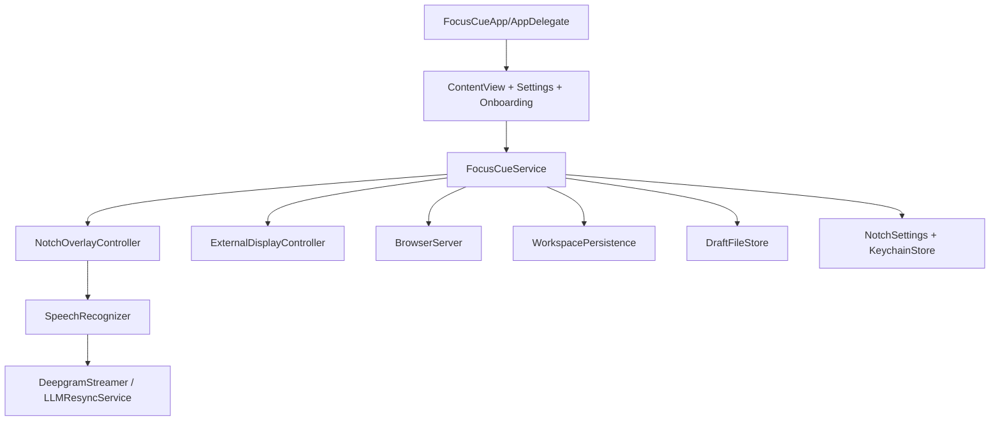

# FocusCue

FocusCue is a macOS teleprompter workspace for camera-adjacent delivery, speech-aware progression, and multi-surface output.

## Product definition and target use cases

FocusCue is designed for people who need to read prepared script content while maintaining natural delivery.

Primary use cases:
- Live calls and presentations where eye-line matters.
- Recorded tutorials and scripted explainers.
- Production setups requiring external/mirrored teleprompter output.
- Remote monitoring of teleprompter state from another device on local network.

## Feature overview by user outcome

### Prepare and organize scripts

- Multi-page workspace with `Live Transcripts` and `Archive` sections.
- Page creation, rename, reorder, move, and delete flows.
- Text editing with page-level dirty/save-failed state visibility.
- Native `.focuscue` save/open support.
- `.pptx` presenter notes import into script pages.

### Deliver naturally while reading

- Listening modes:
  - Word Tracking
  - Voice-Activated
  - Classic
- Speech backends:
  - Apple on-device recognition
  - Deepgram cloud recognition
- Optional Smart Resync with OpenAI key.
- Optional draft refinement for free-run transcript cleanup.

### Run output where you need it

- Overlay display modes:
  - Pinned to notch region
  - Floating
  - Follow-cursor floating
  - Fullscreen
- External display output:
  - Teleprompter mode
  - Mirror mode with axis control
- Browser remote output server over local network.

### Operate safely and reliably

- UserDefaults autosave plus file-backed draft persistence.
- Schema-versioned document wrapper for `.focuscue` files.
- Keychain storage for API keys.
- Update checks against GitHub releases.

## Quick start

## Prerequisites

- macOS with Xcode support for the project deployment target.
- Xcode with command-line tools installed.
- Optional API keys:
  - Deepgram (cloud speech backend)
  - OpenAI (Smart Resync and draft refinement)

## Build and run with Xcode

1. Open `/Users/saransh1337/Developer/Projects/FocusCue/FocusCue.xcodeproj`.
2. Select the `FocusCue` scheme.
3. Build and run on a macOS destination.

## Build via command line (Debug)

```bash
xcodebuild build \
  -project /Users/saransh1337/Developer/Projects/FocusCue/FocusCue.xcodeproj \
  -scheme FocusCue \
  -configuration Debug \
  -destination "platform=macOS" \
  CODE_SIGNING_ALLOWED=NO
```

## Build universal app + DMG locally

```bash
bash /Users/saransh1337/Developer/Projects/FocusCue/build.sh
```

Artifacts are produced under:
- `/Users/saransh1337/Developer/Projects/FocusCue/build/release/`

## First-run guidance (onboarding and permissions)

On first launch, FocusCue can open the onboarding wizard to walk through:
1. Guidance modes and display surfaces.
2. Microphone permission.
3. Speech recognition permission.
4. Initial template/setup actions.

If permissions are denied, onboarding and settings provide shortcuts into macOS Privacy & Security panels.

## Architecture snapshot



## Core contracts

- URL scheme: `focuscue://read?text=...`
- Native document: `.focuscue` (`FocusCueDocumentV3`)
- Draft page document: `.focuscuepage.json` (`DraftPageDocument`)
- Remote payload: `BrowserState` JSON over WebSocket

## What this repo contains

| Path | Description |
| --- | --- |
| `/Users/saransh1337/Developer/Projects/FocusCue/FocusCue/` | macOS app source (UI, service layer, speech, overlays, persistence, integrations) |
| `/Users/saransh1337/Developer/Projects/FocusCue/FocusCue.xcodeproj/` | Xcode project and shared scheme |
| `/Users/saransh1337/Developer/Projects/FocusCue/docs/` | Canonical technical docs and PRD |
| `/Users/saransh1337/Developer/Projects/FocusCue/.github/workflows/` | CI and release automation workflows |
| `/Users/saransh1337/Developer/Projects/FocusCue/build.sh` | Local universal build + DMG script |

## Documentation index (single-entry from this README)

- Product requirements: [`docs/PRD.md`](docs/PRD.md)
- Architecture: [`docs/architecture.md`](docs/architecture.md)
- User workflows: [`docs/user-workflows.md`](docs/user-workflows.md)
- Technical reference: [`docs/technical-reference.md`](docs/technical-reference.md)
- Data and storage: [`docs/data-and-storage.md`](docs/data-and-storage.md)
- Integrations and operations: [`docs/integrations-and-operations.md`](docs/integrations-and-operations.md)
- Development and release: [`docs/development-and-release.md`](docs/development-and-release.md)
- DeepWiki coverage map: [`docs/deepwiki-coverage.md`](docs/deepwiki-coverage.md)
- Design token reference: [`docs/design-tokens.md`](docs/design-tokens.md)

## Documentation map (who should read what)

| Reader | Start here | Then read |
| --- | --- | --- |
| New user | [`docs/user-workflows.md`](docs/user-workflows.md) | [`docs/PRD.md`](docs/PRD.md) |
| Feature contributor | [`docs/architecture.md`](docs/architecture.md) | [`docs/technical-reference.md`](docs/technical-reference.md), [`docs/data-and-storage.md`](docs/data-and-storage.md) |
| Speech/AI contributor | [`docs/integrations-and-operations.md`](docs/integrations-and-operations.md) | [`docs/technical-reference.md`](docs/technical-reference.md), [`docs/user-workflows.md`](docs/user-workflows.md) |
| Release owner | [`docs/development-and-release.md`](docs/development-and-release.md) | [`docs/integrations-and-operations.md`](docs/integrations-and-operations.md) |

## Suggested reading order

### Users

1. [`README.md`](README.md)
2. [`docs/user-workflows.md`](docs/user-workflows.md)
3. [`docs/PRD.md`](docs/PRD.md)

### Contributors

1. [`docs/architecture.md`](docs/architecture.md)
2. [`docs/technical-reference.md`](docs/technical-reference.md)
3. [`docs/data-and-storage.md`](docs/data-and-storage.md)
4. [`docs/integrations-and-operations.md`](docs/integrations-and-operations.md)
5. [`docs/development-and-release.md`](docs/development-and-release.md)

## Source-of-truth policy

- Runtime behavior is authoritative in source under [`FocusCue/`](FocusCue/).
- Build/release behavior is authoritative in [`FocusCue.xcodeproj/`](FocusCue.xcodeproj/), [`build.sh`](build.sh), and [`.github/workflows/`](.github/workflows/).
- Documentation is implementation-derived; update docs whenever behavior changes.
- Historical docs in `docs/audits/` and `docs/parity/` are retained for archive context, not primary navigation.

## Primary source references

- [`FocusCue/FocusCueService.swift`](FocusCue/FocusCueService.swift)
- [`FocusCue/ContentView.swift`](FocusCue/ContentView.swift)
- [`FocusCue/NotchOverlayController.swift`](FocusCue/NotchOverlayController.swift)
- [`FocusCue/SpeechRecognizer.swift`](FocusCue/SpeechRecognizer.swift)
- [`FocusCue/BrowserServer.swift`](FocusCue/BrowserServer.swift)
- [`FocusCue/ExternalDisplayController.swift`](FocusCue/ExternalDisplayController.swift)
- [`FocusCue/WorkspacePersistence.swift`](FocusCue/WorkspacePersistence.swift)
- [`FocusCue/DraftFileStore.swift`](FocusCue/DraftFileStore.swift)
- [`FocusCue/SettingsView.swift`](FocusCue/SettingsView.swift)
- [`build.sh`](build.sh)
