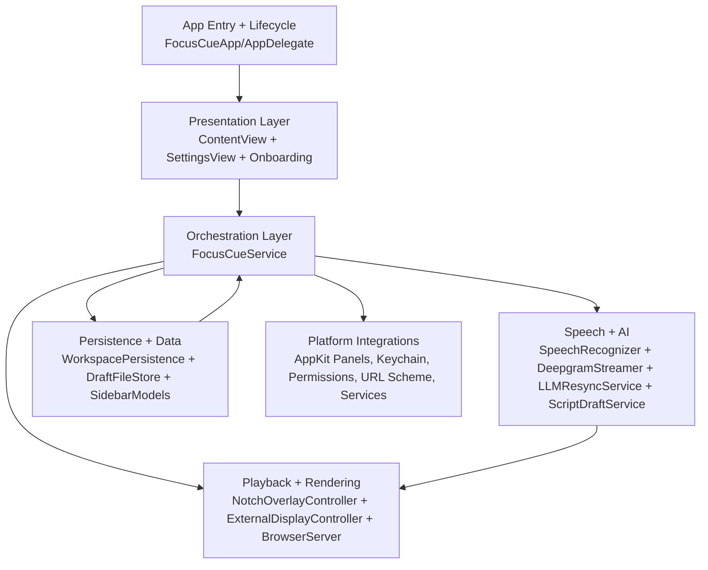
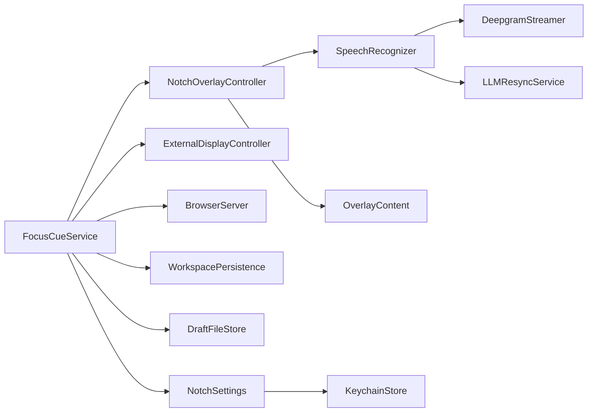
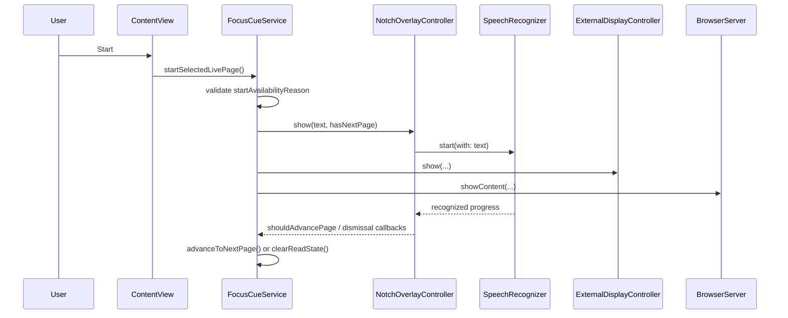

# FocusCue Architecture

## Architecture overview

FocusCue uses a layered macOS architecture with a single orchestration service (`FocusCueService`) coordinating UI state, playback state, persistence, and output surfaces.

At runtime, the system balances four domains:
1. Authoring and page management.
2. Playback and progression.
3. Speech and timing input.
4. Multi-surface rendering/output.

## Layered architecture and subsystem boundaries

### Boundary rules

- UI views should request behavior via service-level methods rather than directly mutating downstream subsystems.
- `FocusCueService` owns workspace mutation, dirty-state tracking, and dispatch to display outputs.
- Output controllers are rendering-focused and should not own authoritative workspace state.
- Persistence classes are storage-focused and should not hold application policy.

## Dependency graph

### Core orchestrator dependencies

- `FocusCueService` directly owns:
  - `NotchOverlayController`
  - `ExternalDisplayController`
  - `BrowserServer`
  - `WorkspacePersistence`
  - `DraftFileStore`
- `NotchOverlayController` owns `SpeechRecognizer` and `OverlayContent`.
- `SpeechRecognizer` conditionally uses `DeepgramStreamer` and `LLMResyncService`.

## Core runtime data flow

### Script authoring flow

1. User edits text in `ContentView` bound to `FocusCueService.textBindingForSelectedPage()`.
2. `FocusCueService` mutates the selected `ScriptPage`, updates titles where needed, and commits workspace changes.
3. Commit path normalizes workspace, reconciles page references, updates dirty state, schedules draft index save, and schedules autosave.
4. Sidebar and command panels re-render from derived section models.

### Playback flow

1. User presses Start in main window.
2. `FocusCueService.startSelectedLivePage()` validates readiness and calls `readCurrentPage()`.
3. `NotchOverlayController` renders active overlay mode and begins speech/timer progression.
4. `ExternalDisplayController` and `BrowserServer` receive synchronized content state.
5. On completion, dismiss callback clears read state and restores main-window focus.

## App lifecycle (launch, URL handling, window/menu behavior)

### Launch path

- `AppDelegate.applicationWillFinishLaunching` disables automatic window tabbing.
- External URL launch can switch activation policy to accessory mode and hide main window.
- `applicationDidFinishLaunching` registers services, performs silent update check, and starts browser server if enabled.

### URL and file handling

- `.focuscue` URLs/files route into native document open behavior.
- `focuscue://read?text=...` routes into direct read mode through `handleURL(_:)`.
- App reopen logic restores regular activation mode when returning from external launch state.

### Window/menu policy

- Main window close action hides rather than destroys the window.
- View/Window menus are removed from app menu for a constrained command surface.
- App commands expose About, Check for Updates, Open/Save/Save As, Settings, and Getting Started.

## Service-layer orchestration (`FocusCueService` as center)

### Responsibilities

1. Own in-memory workspace and saved baseline state.
2. Expose derived UI models (sidebar sections, start availability, unsaved state).
3. Handle page CRUD/reorder/move and read-state transitions.
4. Coordinate all output surfaces for synchronized playback.
5. Handle file IO (`.focuscue` + `.pptx` import).
6. Coordinate autosave and draft persistence.

### Commit path contract

Any workspace mutation should eventually pass through commit logic that performs:
- normalization,
- draft reference reconciliation,
- saved-file relocation as needed,
- dirty-state refresh,
- draft-index save scheduling,
- autosave scheduling,
- overlay page-metadata refresh.

## Threading and queueing model

| Area | Queue/Thread behavior |
| --- | --- |
| UI mutations | Main thread (`@Observable` state consumed by SwiftUI/AppKit) |
| Autosave scheduling | Main-thread dispatch timer + encoded write |
| Draft index delayed write | Background utility queue with `DispatchWorkItem` |
| `.pptx` import | Global user-initiated queue, then marshaled to main thread for state updates |
| Speech recognition callbacks | Backend callbacks normalized to main-thread state updates |
| Network update check | URLSession async callback; UI alerts dispatched on main thread |

## Error-handling strategy

### Principles

- Preserve editing/playback flow where possible.
- Surface actionable user feedback with clear alert text for blocking operations.
- Keep non-critical persistence failures recoverable (track failed page saves instead of crashing).

### Error classes

1. Blocking user operations (open/save/import) -> modal `NSAlert` with message and detail.
2. Recoverable page-save failures -> `saveFailedPageIDs` tracked and surfaced in UI state.
3. Runtime backend/permission issues -> settings/onboarding guidance and fallback modes.

## Security and entitlements boundary

FocusCue runs sandboxed with explicit entitlements for:
- user-selected file read/write,
- audio input,
- network client/server,
- keychain access group.

This keeps access scoped while enabling local persistence, microphone input, remote output server, and API-key storage.

## Design constraints and tradeoffs

1. Single-service orchestration simplifies coordination but requires strict discipline around service boundary growth.
2. Multiple output surfaces share progression state, so timing drift must be minimized by central progression ownership.
3. Dual persistence (autosave + file-backed drafts) increases resilience but adds reconciliation complexity.
4. Support for both local and cloud speech backends improves flexibility while increasing operational edge cases.

## Primary source files

- [`../FocusCue/FocusCueApp.swift`](../FocusCue/FocusCueApp.swift)
- [`../FocusCue/ContentView.swift`](../FocusCue/ContentView.swift)
- [`../FocusCue/FocusCueService.swift`](../FocusCue/FocusCueService.swift)
- [`../FocusCue/NotchOverlayController.swift`](../FocusCue/NotchOverlayController.swift)
- [`../FocusCue/ExternalDisplayController.swift`](../FocusCue/ExternalDisplayController.swift)
- [`../FocusCue/BrowserServer.swift`](../FocusCue/BrowserServer.swift)
- [`../FocusCue/SpeechRecognizer.swift`](../FocusCue/SpeechRecognizer.swift)
- [`../FocusCue/WorkspacePersistence.swift`](../FocusCue/WorkspacePersistence.swift)
- [`../FocusCue/DraftFileStore.swift`](../FocusCue/DraftFileStore.swift)
- [`../FocusCue/NotchSettings.swift`](../FocusCue/NotchSettings.swift)
- [`../FocusCue/PermissionCenter.swift`](../FocusCue/PermissionCenter.swift)
