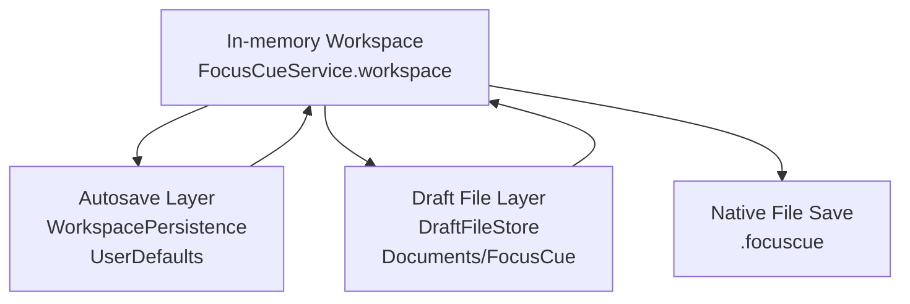
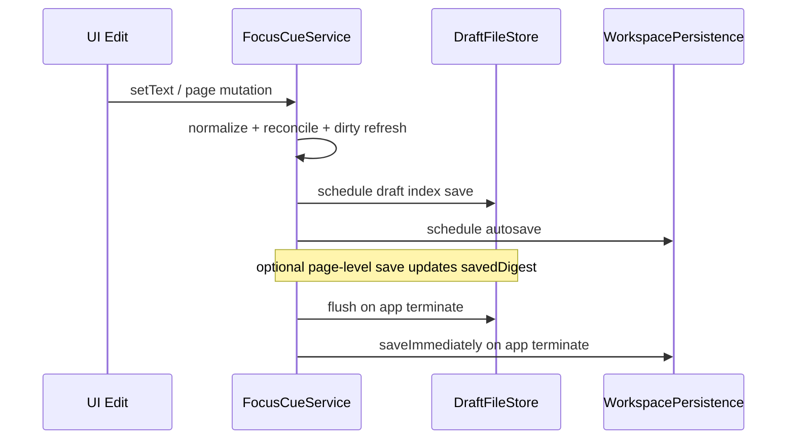

# FocusCue Data and Storage

## Purpose

This document describes FocusCue's runtime data model and persistence architecture, including autosave, file-backed drafts, dirty-state detection, schema version handling, and recovery behavior.

## Core data model

## Workspace model

`ScriptWorkspace` is the canonical in-memory model:
- `livePages: [ScriptPage]`
- `archivePages: [ScriptPage]`
- `selectedPageID: UUID?`
- `nextPageCounter: Int`

`ScriptPage` fields:
- `id: UUID`
- `title: String`
- `text: String`
- `isCustomTitle: Bool`

## Document wrappers

- `FocusCueDocumentV3` wraps workspace for native `.focuscue` files.
- `DraftWorkspaceIndex` stores draft snapshot + page references.
- `DraftPageDocument` stores per-page payload and module location.

## Persistence architecture

FocusCue uses dual persistence layers for resilience and responsiveness.

### Layer 1: UserDefaults autosave (`WorkspacePersistence`)

- Key: `focuscue.workspace.v3`
- Payload: encoded `FocusCueDocumentV3`
- Behavior:
  - `scheduleSave` delays writes to reduce churn during rapid edits.
  - `saveImmediately` used for forced persistence paths (termination/explicit flush).
  - `restoreWorkspace` attempts schema-valid restore on startup.

### Layer 2: File-backed drafts (`DraftFileStore`)

- Root: `~/Documents/FocusCue`
- Important paths:
  - `workspace.index.json`
  - `LiveTranscripts/<uuid>.focuscuepage.json`
  - `Archive/<uuid>.focuscuepage.json`
- Behavior:
  - page-level saves include digest metadata for dirty tracking
  - page files can be relocated when module changes
  - deleted page files are trashed when possible

### Layer 3: Native document persistence (`.focuscue`)

- Save/open path serializes/deserializes `FocusCueDocumentV3`.
- Used for explicit user-managed document exchange and archival outside autosave/draft internals.

## Dirty-state and digest logic

`FocusCueService` computes page digest using:
- page ID
- title
- custom-title flag
- text

Digest algorithm: SHA256.

### Dirty-state rules

A page is dirty when:
1. It has a draft reference and current digest differs from `savedDigest`, or
2. It has no draft reference and has meaningful content/custom title.

A page is save-failed when draft save/relocation operations throw; this state is tracked independently so UI can show degraded persistence for specific pages.

## Schema versioning behavior

### Native `.focuscue` schema

- Current wrapper type: `FocusCueDocumentV3`
- `schemaVersion` must equal `FocusCueDocumentV3.currentSchemaVersion`.
- Mismatch behavior: open operation is rejected with unsupported schema alert.

### Draft schema

- `DraftWorkspaceIndex.currentSchemaVersion`
- `DraftPageDocument.currentSchemaVersion`
- Draft restore ignores incompatible index payloads by returning `nil`.

### Unsupported format handling

- Legacy array-only format (`[String]`) is explicitly recognized and rejected with dedicated alert copy.
- Unknown/unparseable payloads trigger generic open error messaging.

## Recovery and reconciliation behavior

### Startup restore path

1. Initialize persistence stores.
2. Attempt draft index restore from `DraftFileStore`.
3. If restore succeeds, use restored workspace and page references.
4. If restore fails, fall back to default workspace.
5. Normalize workspace and reconcile draft references.

### Commit-time reconciliation

On workspace mutation, `FocusCueService` performs:
1. `normalizeWorkspace()`
2. `reconcileDraftReferences()`
3. `syncSavedPageFilesToCurrentLocations()`
4. `refreshDirtyPageState()`
5. schedule/flush index persistence
6. schedule autosave

### Termination path

`flushPendingPersistence()` cancels pending work, flushes draft index immediately, and saves workspace autosave payload.

## Keychain usage for secrets

`KeychainStore` stores:
- Deepgram API key
- OpenAI API key

This keeps service keys outside markdown/config/userdefaults payloads.

## Data lifecycle sequence

## Operational caveats

1. Draft file location lives in user Documents path; external file-system restrictions can impact save reliability.
2. Autosave and draft layers are complementary but independent; success in one does not imply success in the other.
3. Deleting pages attempts trash operation for page files; failure is intentionally non-fatal.
4. Schema mismatch is currently reject-only rather than auto-migrate.

## Primary source files

- [`../FocusCue/SidebarModels.swift`](../FocusCue/SidebarModels.swift)
- [`../FocusCue/FocusCueService.swift`](../FocusCue/FocusCueService.swift)
- [`../FocusCue/WorkspacePersistence.swift`](../FocusCue/WorkspacePersistence.swift)
- [`../FocusCue/DraftFileStore.swift`](../FocusCue/DraftFileStore.swift)
- [`../FocusCue/KeychainStore.swift`](../FocusCue/KeychainStore.swift)
