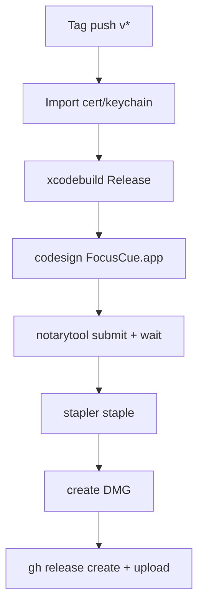

# Development and Release

## Scope

This document covers local development builds, CI validation, release automation, required secrets, and failure diagnostics.

## Local build flows

## Xcode build (recommended day-to-day)

1. Open `FocusCue.xcodeproj`.
2. Select scheme `FocusCue`.
3. Build/run with a macOS destination.

## CLI debug build

```bash
xcodebuild build \
  -project /Users/saransh1337/Developer/Projects/FocusCue/FocusCue.xcodeproj \
  -scheme FocusCue \
  -configuration Debug \
  -destination "platform=macOS" \
  CODE_SIGNING_ALLOWED=NO
```

## Local universal binary + DMG build

```bash
bash /Users/saransh1337/Developer/Projects/FocusCue/build.sh
```

`build.sh` performs:
1. arm64 archive
2. x86_64 archive
3. `lipo` merge into universal app
4. DMG staging and packaging

Artifacts are written under:
- `/Users/saransh1337/Developer/Projects/FocusCue/build/release/`

## Build system structure

| File | Responsibility |
| --- | --- |
| [`../build.sh`](../build.sh) | Local universal archive + DMG flow |
| [`../FocusCue.xcodeproj/project.pbxproj`](../FocusCue.xcodeproj/project.pbxproj) | Build settings, entitlements, bundle ID, target config |
| [`../FocusCue.xcodeproj/xcshareddata/xcschemes/FocusCue.xcscheme`](../FocusCue.xcodeproj/xcshareddata/xcschemes/FocusCue.xcscheme) | Shared scheme configuration |

## CI workflow behavior

Workflow file: [`../.github/workflows/ci.yml`](../.github/workflows/ci.yml)

### Trigger rules

- Push to `main`
- Pull request targeting `main`

### CI job behavior

- Runner: `macos-15`
- Action: checkout repository
- Build: debug `xcodebuild` with `CODE_SIGNING_ALLOWED=NO`
- Concurrency: per-workflow/ref grouping with cancel-in-progress enabled

## Release workflow behavior

Workflow file: [`../.github/workflows/release.yml`](../.github/workflows/release.yml)

### Trigger rule

- Push tag matching `v*`

### Release stages

1. Checkout source.
2. Import signing certificate into temporary keychain.
3. Build release app.
4. Code sign app with Developer ID identity.
5. Notarize zipped app and staple ticket.
6. Create DMG artifact.
7. Create GitHub release and upload DMG.



## Required secrets

| Secret | Used for |
| --- | --- |
| `APPLE_CERTIFICATE` | Base64 p12 for signing identity |
| `APPLE_CERTIFICATE_PASSWORD` | p12 import password |
| `APPLE_ID` | Apple account for notarization |
| `APPLE_PASSWORD` | App-specific password/token for notarization |
| `APPLE_TEAM_ID` | Team ID for notarization/auth |
| `GITHUB_TOKEN` | Release creation/upload API access |

## Validation checklist (pre-release)

1. CI debug build passes on latest `main`.
2. Local debug build and local release build both succeed.
3. App launches and core smoke paths pass:
   - script edit/save/open
   - playback across selected modes
   - `.pptx` import
   - remote/external output check
4. Signing identity is detected in release runner output.
5. Notarization returns valid status and stapling completes.
6. DMG contains expected app bundle and installs cleanly.

## Common failure diagnostics

| Failure point | Symptom | Likely cause | Resolution |
| --- | --- | --- | --- |
| `xcodebuild` in CI | Build exit non-zero | project/scheme mismatch, SDK/runner changes, compile issue | Re-run with verbose local build and fix compile/config drift. |
| Signing step | No valid identity found | certificate secret malformed or missing | Recreate/export Developer ID p12, re-encode base64, update secret. |
| Notarization | Invalid/rejected submission | missing hardened runtime/signature issues | Inspect notarization log, ensure signed app and entitlements are valid. |
| DMG upload | release command fails | missing token permissions or release creation conflict | Validate `contents: write` permission and tag uniqueness. |
| Local universal build | lipo merge incomplete | architecture-specific archive failure | Verify both arm64/x86_64 archive outputs exist before merge. |

## Contributor workflow recommendation

1. Build locally in Debug before committing.
2. Keep documentation aligned with behavioral changes in source.
3. Avoid release-tag pushes until smoke checklist is complete.
4. For release changes, validate both workflow files and `build.sh` consistency.

## Related files

- [`../build.sh`](../build.sh)
- [`../.github/workflows/ci.yml`](../.github/workflows/ci.yml)
- [`../.github/workflows/release.yml`](../.github/workflows/release.yml)
- [`../FocusCue.xcodeproj/project.pbxproj`](../FocusCue.xcodeproj/project.pbxproj)
- [`../FocusCue/FocusCue.entitlements`](../FocusCue/FocusCue.entitlements)
