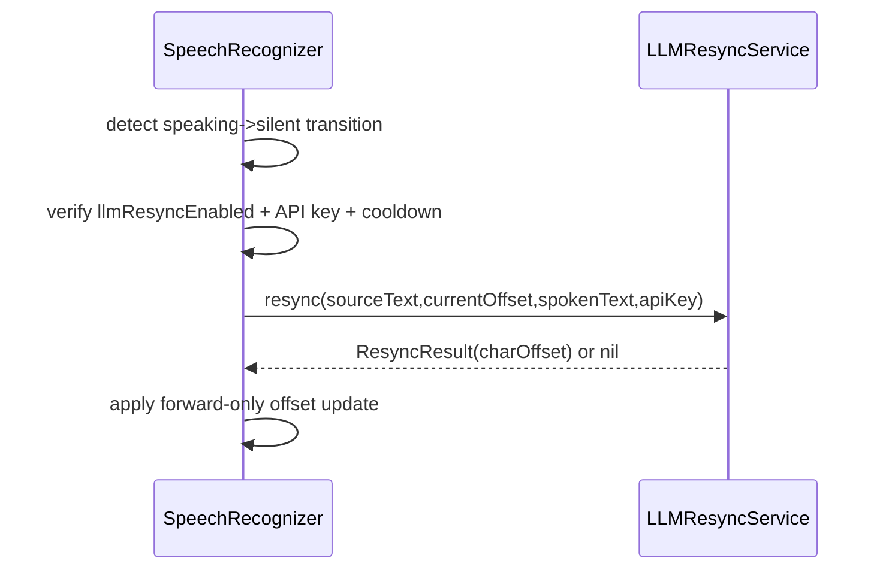
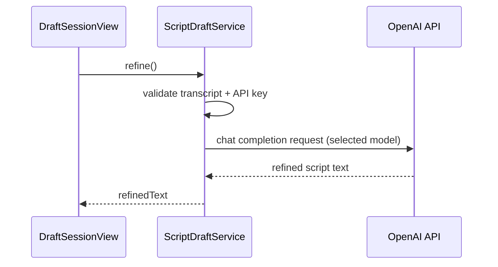
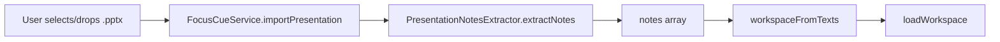

# Integrations and Operations

## Overview

This document covers operational integrations that sit at the boundary of FocusCue and external systems: speech backends, AI services, platform permissions, update checks, and import/export pipelines.

## Speech backends (Apple vs Deepgram)

| Aspect | Apple backend | Deepgram backend |
| --- | --- | --- |
| Mode | On-device speech recognition | Cloud speech recognition over WebSocket |
| Network dependency | No (for core recognition) | Yes |
| Key requirement | None | Deepgram API key in Keychain |
| Authorization gates | Speech + microphone permissions | Microphone permission + valid API key |
| Result style | Partial transcript callbacks | Word stream + utterance finalization |
| Recovery style | Retry/restart recognition tasks | Stream status callbacks and reconnect path via resume/start |

## Runtime behavior notes

- `SpeechRecognizer.start(with:)` chooses backend based on `NotchSettings.speechBackend`.
- Missing Deepgram key blocks start with actionable error.
- Mic switching uses selected UID where available.
- `isSpeaking` is derived from recent audio-level average and drives voice-activated progression.

## Smart Resync and script refinement

FocusCue includes two OpenAI-backed paths:

1. Smart Resync (`LLMResyncService`) during playback.
2. Draft refinement (`ScriptDraftService.refine`) after free-run capture.

## Smart Resync flow

### Smart Resync safeguards

- Cooldown between requests to avoid request storms.
- In-flight gate to avoid concurrent resync calls.
- Forward-only progress application (never rewinds recognized offset).

## Draft refinement flow

### Refinement operational notes

- Refine action is explicitly user-triggered from draft review phase.
- Model selection is controlled by `NotchSettings.refinementModel`.
- Failure paths surface API or parsing errors in dialog state.

## Permissions and entitlements runtime behavior

## Runtime permissions

- Microphone: required for non-classic speech-driven modes.
- Speech recognition: required for Apple speech backend.

Permission handling appears in:
- onboarding flow (`OnboardingWizardView` + `PermissionCenter`)
- runtime speech start checks (`SpeechRecognizer`)
- settings guidance copy (`SettingsView`)

## Entitlements

Key entitlements include:
- app sandbox
- audio input
- user-selected file read/write
- network client/server
- keychain access group

Source:
- [`../FocusCue/FocusCue.entitlements`](../FocusCue/FocusCue.entitlements)

## Update checker behavior

## Trigger points

1. Silent check on app launch.
2. Manual check from app command menu.

## Operational flow

1. Call GitHub latest release API for configured repo.
2. Parse `tag_name` + `html_url`.
3. Compare semantic-ish dotted versions.
4. Present one of:
   - update available prompt,
   - up-to-date confirmation,
   - error alert.

Source:
- [`../FocusCue/UpdateChecker.swift`](../FocusCue/UpdateChecker.swift)

## Import/export operational pipelines

## Native `.focuscue` pipeline

- Save path writes encoded `FocusCueDocumentV3` atomically.
- Open path decodes and validates schema version.
- Unsupported schema/legacy formats produce explicit alerts.

## `.pptx` import pipeline

Operational details:
- Parsing runs on background queue.
- UI state updates are applied on main thread.
- Empty/missing notes return user-facing import errors.

## Browser remote operational behavior

- HTTP listener on configured port.
- WebSocket listener on `port + 1`.
- Broadcast tick every 100ms while content active.
- Inactive payload broadcast when content hides/stops.

## Operational caveats and failure modes

| Area | Failure mode | Observable symptom | Recommended operator action |
| --- | --- | --- | --- |
| Deepgram backend | Missing/invalid key | Start failure message in guidance paths | Add valid key in settings and retry. |
| Apple speech | Permission denied | No recognition progress + permission guidance | Grant mic/speech permission and restart recognition. |
| LLM resync | API unavailable | No resync corrections during pauses | Continue with base matching or disable feature for session. |
| Browser remote | Port collision or no LAN reachability | Viewer cannot connect | Change port, restart server, verify same network and local IP. |
| External display | Target display unavailable | No external panel visible | Refresh display list and reselect target screen. |
| `.pptx` import | Unsupported/empty notes payload | Import error alert | Re-export deck with presenter notes and retry. |
| Update check | API/network failure | Update check failed alert | Retry later; verify network access. |

## Operations checklist

1. Verify permissions before live session.
2. Confirm backend keys (if using Deepgram/OpenAI features).
3. Validate output surfaces (overlay + external + remote as needed).
4. Validate save state for all dirty pages.
5. Keep fallback mode ready (Classic) if speech services degrade.

## Primary source files

- [`../FocusCue/SpeechRecognizer.swift`](../FocusCue/SpeechRecognizer.swift)
- [`../FocusCue/DeepgramStreamer.swift`](../FocusCue/DeepgramStreamer.swift)
- [`../FocusCue/LLMResyncService.swift`](../FocusCue/LLMResyncService.swift)
- [`../FocusCue/ScriptDraftService.swift`](../FocusCue/ScriptDraftService.swift)
- [`../FocusCue/PermissionCenter.swift`](../FocusCue/PermissionCenter.swift)
- [`../FocusCue/SettingsView.swift`](../FocusCue/SettingsView.swift)
- [`../FocusCue/UpdateChecker.swift`](../FocusCue/UpdateChecker.swift)
- [`../FocusCue/PresentationNotesExtractor.swift`](../FocusCue/PresentationNotesExtractor.swift)
- [`../FocusCue/BrowserServer.swift`](../FocusCue/BrowserServer.swift)
- [`../FocusCue/ExternalDisplayController.swift`](../FocusCue/ExternalDisplayController.swift)
- [`../FocusCue/FocusCue.entitlements`](../FocusCue/FocusCue.entitlements)
